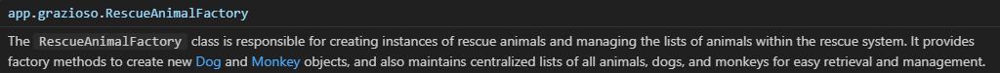

# Enhancement One: Software Engineering and Design

[Download Enhancement One](../EnhancementOne.zip)

As a recap, the chosen artifact for this enhancement was a Java-based console application developed for Grazioso Salvare, initially created during the "Foundation in Application Development" (IT 145) course at SNHU. This project was selected for its potential to be transformed from a basic introductory object-oriented programming model to a sophisticated, scalable, and modular software system. The primary focus of this enhancement was the introduction of the `RescueAnimalFactory` class.

## About the Enhancement

The implementation of the `RescueAnimalFactory` class marked a significant improvement in the software's architecture. By centralizing object instantiation, this factory design pattern enforced the "separation of concerns" principle, crucial for maintaining a clean and manageable codebase. This design choice not only enhanced the modularity of the application but also facilitated future scalability and the integration of new animal types into the system seamlessly.

### Object Creation Moved to RescueAnimalFactory Class
**Method to create a Dog object and add it to the appropriate array lists:**
```java
public static Dog createDog(String name, String breed, String gender,
        String age, String weight, String acquisitionDate, 
        String acquisitionCountry, String trainingStatus, 
        boolean reserved, String inServiceCountry) {
    Dog dog = new Dog(name, breed, gender, age, weight, 
        acquisitionDate, acquisitionCountry, trainingStatus, 
        reserved, inServiceCountry);
    dogList.add(dog); // Dog ArrayList
    animalList.add(dog); // RescueAnimal ArrayList
    return dog;
}
```
**Method to create a Monkey object and add it to the appropriate array lists:**
```java
public static Monkey createMonkey(String name, String tailLength, 
        String height, String bodyLength, String species, 
        String gender, String age, String weight, 
        String acquisitionDate, String acquisitionCountry, 
        String trainingStatus, boolean reserved, 
        String inServiceCountry) {
    Monkey monkey = new Monkey(name, tailLength, height, bodyLength, 
        species, gender, age, weight, acquisitionDate, 
        acquisitionCountry, trainingStatus, reserved, 
        inServiceCountry);
    monkeyList.add(monkey); // Monkey ArrayList
    animalList.add(monkey); // RescueAnimal ArrayList
    return monkey;
}
```

Now, the `Driver` class is relieved of these duties and can focus more on managing user interactions and system operations, thereby making the codebase cleaner and the application more maintainable. This refactoring allows for easier future enhancements and additions of new functionalities without overcomplicating the `Driver` class.

### JavaDoc Comments
Further strengthening the software's architecture, comprehensive JavaDoc comments were introduced to enhance the clarity and instructional value of the code, aligning with the goal to produce professional-quality communications suitable for diverse audiences. This strategic move improved the overall comprehensibility of the codebase, serving both educational and practical purposes in software development.

**JavaDoc comment for** `RescueAnimalFactory` **class:**
```java
/**
 * The {@code RescueAnimalFactory} class is responsible for creating 
 * instances of rescue animals and managing the lists of animals 
 * within the rescue system. It provides factory methods to create 
 * new {@link Dog} and {@link Monkey} objects, and also maintains 
 * centralized lists of all animals, dogs, and monkeys for easy 
 * retrieval and management.
 */
```

Below is a screenshot of the tooltip that appears when hovering over a reference to the `RescueAnimalFactory` class within the IDE, showcasing the utility of the JavaDoc comments for enhancing developer understanding and ease of use:



## Additional Enhancements

### Enhanced User Interaction with promptAndRead Method

To further improve user interaction within the Grazioso Salvare system, I implemented the `promptAndRead` method. This method enhances the application's robustness by validating user inputs and allowing for graceful cancellation of operations.

The `promptAndRead` method prompts users for input and validates this input against predefined criteria. Crucially, it offers an immediate exit option — "CANCEL" — which, when input by the user, cancels the operation and returns them to the main menu. This feature ensures that users can easily navigate and control their actions within the application without the risk of unintentional data submission or errors.

```java
/**
 * Prompts the user for input and allows for input validation or cancellation.
 * If "CANCEL" is input, the operation can be aborted.
 * 
 * @param scanner The Scanner object for reading user input.
 * @param prompt The prompt message to display to the user.
 * @param validations Optional list of valid input values.
 * @return The user's input or null if the operation is cancelled.
 */
public static String promptAndRead(Scanner scanner, String prompt, String... validations) {
    String input;
    while (true) {
        System.out.println(prompt);
        input = scanner.nextLine();

        if ("CANCEL".equalsIgnoreCase(input)) {
            System.out.println("Operation cancelled.");
            return null; // Indicates the user cancelled the operation
        }

        if (validations.length == 0 || Arrays.stream(validations).anyMatch(input::equalsIgnoreCase)) {
            return input; // Valid input
        }

        System.out.println("Invalid input. Please try again.");
    }
}
```

This method not only simplifies the process of gathering and validating user input but also enhances the overall user experience by integrating a straightforward mechanism for operation cancellation. This functionality exemplifies the application's user-centered design, where ease of use and user control are prioritized.

## Alignment with Course Outcomes

This enhancement directly aligns with several core course outcomes, emphasizing the development of scalable software solutions and delivery of professional-quality communications. The structural innovations implemented in the `RescueAnimalFactory` class demonstrate advanced software engineering techniques and contribute significantly to the development of computing solutions that are valuable, efficient, and tailored to specific industry needs.

Specifically, this project addresses the course outcomes by enhancing collaborative environments through improved code modularity, fostering better teamwork and maintenance capabilities. It also supports the creation of innovative computing techniques by implementing a design pattern that anticipates future system expansions and integration challenges.

## Challenges and Learnings

Integrating the `RescueAnimalFactory` without disrupting existing functionalities presented a moderate challenge. This process required meticulous planning and testing to ensure compatibility and performance. Through this experience, I deepened my understanding of design patterns and their practical applications in enhancing software maintainability and scalability.

Adhering to rigorous documentation standards and employing JavaDoc effectively were key learnings that enhanced my ability to communicate complex technical details clearly. This practice not only facilitated easier code maintenance but also ensured that any programmer could understand and engage with the codebase effectively, highlighting the importance of clear and intentional commenting.

## Skills Demonstrated

Through this enhancement, I demonstrated proficiency in advanced object-oriented programming, application of software design patterns, and effective communication of complex technical details through code documentation. The successful implementation of the `RescueAnimalFactory` class showcases my capability to refactor and improve an existing codebase, enhancing its efficiency, maintainability, and adaptability.

[Return to Home](/)  
[Enhancement Two Page](/enhancement-two)  
[Enhancement Three Page](/enhancement-three)  
  
[Download Enhancement One](../EnhancementOne.zip)

