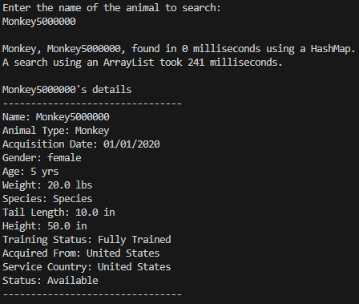
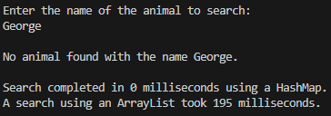

# Enhancement Two: Algorithms and Data Structure

[Download Enhancement Two](../EnhancementTwo.zip)

Reflecting on the progression of the Grazioso Salvare Rescue Animal Management System, this enhancement built upon the foundational software engineering and design improvements made previously, by enhancing the project in the algorithms and data structures category. The aim was to transition the system from a basic to a sophisticated application demonstrating my capabilities in optimizing data retrieval processes using advanced data structures.

## About the Enhancement

The enhancement focused on improving the efficiency of searching for an animal by name within the Grazioso Salvare application. By integrating a hash map, I significantly optimized the search process, reducing the time complexity from O(n) to O(1) for the best-case scenarios.

### Seed In-Memory Storage
To demonstrate the improvement, I populated the system with a large number of Dog and Monkey objects using for loops. These objects were added to both an ArrayList and a HashMap for comparison:

```java
// Populating the system with 5000000 Dog objects
for (int i = 1; i <= 5000000; i++) {
    createDog("Dog" + i, "Great Dane", "male", "5", "20.0", 
              "01/01/2020", "USA", "intake", false, "USA");
}
```

The above loop simulates the addition of millions of Dog objects, each with a unique identifier.

```java
// Populating the system with 5000000 Monkey objects
for (int i = 1; i <= 5000000; i++) {
    createMonkey("Monkey" + i, 10.0, 50.0, "Species", "female", 5, 
    20.0, "01/01/2020", "United States", "Fully Trained", false, 
    "United States");
}
```

Similarly, this loop adds a significant number of Monkey objects, ensuring a comprehensive dataset for my search optimization tests.

### Searching by ArrayList and HashMap
The original search method used an ArrayList, which required iterating through all elements to find a match:

```java
public static RescueAnimal searchAnimalByNameArrayList(String name) {
    for (RescueAnimal animal : animalArrayList) {
        if (name.equalsIgnoreCase(animal.getName())) {
            return animal;
        }
    }
    return null;
}
```

While functional, the above method is inefficient for large datasets as it performs a linear search.

The new search method leverages a HashMap, providing immediate access to the objects by their names:

```java
public static RescueAnimal searchAnimalByNameHashMap(String name) {
    return animalHashMap.get(name.toLowerCase());
}
```
### Performance Comparison

When it comes to searching through data, the choice of data structure can make a drastic difference in performance. To illustrate this, I compared the search times between using a hash map and an array list.

The search duration for both the hash map and the array list methods was calculated by recording the time immediately before and after each method call, and then determining the difference between these two timestamps.

```java
// Timing search in a hash map
long startTimeHashMap = System.currentTimeMillis();
RescueAnimal foundAnimalHashMap = RescueAnimalFactory
    .searchAnimalByNameHashMap(searchName);
long endTimeHashMap = System.currentTimeMillis();

// Timing search in an array list
long startTimeArrayList = System.currentTimeMillis();
RescueAnimalFactory.searchAnimalByNameArrayList(searchName);
long endTimeArrayList = System.currentTimeMillis();

// Calculate the durations
long durationHashMap = endTimeHashMap - startTimeHashMap;
long durationArrayList = endTimeArrayList - startTimeArrayList;
```

### Results



The hash map executed the search instantly, taking 0 milliseconds, whereas the array list took 241 milliseconds for the same operation.

Even when the target animal doesn't exist, the hash map maintains its swift performance:



Once again, the hash map search was immediate, showing 0 milliseconds, while the array list search slowed down to 195 milliseconds.

## Additional Enhancements
I further enhanced the system by updating animal attributes, deleting records, and canceling reservations to increase administrative versatility. I introduced validation methods like `validateAge` and `validateWeight` to ensure the accuracy and integrity of data entered into the system. Additionally, I implemented the `printAnimalDetailsPaginated` method to improve user interaction by displaying animal details in a manageable, paginated format, which is particularly useful for navigating large datasets. The change from 'String' to 'Date' for acquisition dates and the revamping of the user interface improved navigability and aesthetic appeal.

These improvements not only enhanced the system’s organization and maintainability but also demonstrated my commitment to best practices in software development and a security-minded approach. Through these enhancements, I directly addressed key program outcomes, notably in designing robust computing solutions and developing a security mindset.

### Data Validation Method
As an example of methods dedicated to input validation, here is how I implemented the `validateAge` method to ensure that the age entered is appropriate for the animal type:

```java
/**
 * Prompts the user to enter the age of an animal, validates the input to ensure
 * it's within a valid range, and allows for the operation to be cancelled. This 
 * method uses a loop to continuously prompt the user until a valid age is entered 
 * or the user cancels the operation.
 *
 * @param scanner The Scanner object used to read user input.
 * @param name    The name of the animal, used in the prompt to personalize the
 *                message.
 * @return The validated age as an integer, or null if the operation is
 *         cancelled.
 */
public static Integer validateAge(Scanner scanner, String name) {
	while (true) {
		String ageString = promptAndRead(scanner, "What is " + name + "'s age?");
		if (ageString == null)
			return null; // Handle cancellation
			try {
			int age = Integer.parseInt(ageString);
			if (age >= 1 && age <= 100) {
				return age; // Valid age, return it
			} else {
				System.out.println("Age must be between 1 and 100 years. Please try again.");
			}
		} catch (NumberFormatException e) {
			System.out.println("Invalid input. Please enter a valid number for the age.");
		}
	}
}
```

### Improving User Experience with Paginated Displays
To enhance user experience and manageability of data, I developed the `printAnimalDetailsPaginated` method. This method optimizes how animal details are presented by implementing a pagination system. Instead of overwhelming the user with an extensive list of animals, it displays only five animals at a time. This allows users to digest information in manageable chunks and makes it significantly easier to navigate through large datasets.

By inputting 'n', users can navigate to the next page of animal details, which helps in efficiently browsing without clutter. This method not only simplifies the user interface but also directly improves the overall user experience by making data interaction more intuitive and less daunting.

```java
/**
 * Displays a list of rescue animals with pagination, allowing the user to view
 * a subset of animals at a time. The user can navigate through the list by 
 * requesting the next page of animals. Optionally, if the reserve flag is set 
 * to true, the user can also input the name of an animal to initiate a
 * reservation process.
 * 
 * This method is designed to enhance user interaction by breaking down a
 * potentially large list of animals into manageable pages, making it easier to 
 * browse through the list. Additionally, the optional reservation functionality 
 * provides a direct way to reserve an animal without leaving the
 * pagination view.
 *
 * @param animals The list of {@link RescueAnimal} objects to be displayed. Each
 *                animal's details are printed using the {@code printAnimalDetails}
 *                method.
 * @param scanner The {@link Scanner} object used to read user input, allowing
 *                for navigation and selection within the paginated list.
 * @param reserve A boolean flag indicating whether the method should listen for
 *                reserving an animal in addition to pagination controls. When true, 
 *                entering an animal's name directly initiates a reservation for that
 *                animal.
 * @return The {@link RescueAnimal} object that the user selected for
 *         reservation, if any, and if the reserve flag
 *         is true. Returns null if no selection is made, the operation is
 *         cancelled, or the reserve flag is false.
 */
public static RescueAnimal printAnimalDetailsPaginated(List<? extends RescueAnimal> animals, Scanner scanner,
		boolean reserve) {
	if (animals.isEmpty()) {
		System.out.println("\nNo animals to display.");
		return null;
	}
		int pageSize = 5;
	int page = 0;
		while (true) {
		int start = page * pageSize;
		int end = Math.min((page + 1) * pageSize, animals.size());
			for (int i = start; i < end; i++) {
			RescueAnimal animal = animals.get(i);
			printAnimalDetails(animal); // Prints details of a single animal
		}
			if (end >= animals.size()) {
			System.out.println("End of list. "
					+ (reserve ? "You may enter an animal's name to reserve that animal or p" : "P") +
					"ress Enter to return to the menu.");
		} else {
			System.out.println("Enter 'n' for the next page, or any other key to exit."
					+ (reserve ? " You may also enter an animal's name to reserve that animal." : ""));
		}
			String input = scanner.nextLine();
			if (reserve) {
			for (RescueAnimal animal : animals) {
				if (input.equalsIgnoreCase(animal.getName())) {
					return animal;
				}
			}
		}
			if (end >= animals.size() || !"n".equalsIgnoreCase(input)) {
			break; // User chose not to continue or end of list reached
		}
			if ("n".equalsIgnoreCase(input)) {
			page++; // Go to the next page
		}
	}
	return null; // No action taken or not applicable
}
```

## Alignment with Course Outcomes

This enhancement significantly aligns with core course outcomes, particularly in designing and evaluating efficient computing solutions and employing innovative computing techniques. The use of hash maps to optimize search functionalities within the Grazioso Salvare system showcases advanced algorithmic applications that enhance operational efficiency. This project emphasizes the implementation of data structures that are crucial for high-performance computing solutions, reflecting a strategic approach to software development that is adaptable and efficient.

Specifically, this enhancement supports the course outcomes by demonstrating the effective use of innovative techniques and well-founded skills in computing practices, aimed at improving system performance and achieving industry-specific goals. It further exemplifies the practical application of advanced data structures, preparing the system for scalable growth and future integration of more complex functionalities.

## Challenges and Learnings

Integrating hash maps into the existing system to optimize search functionality presented minimal challenges, primarily centered around adapting the new data structure seamlessly into the codebase. The main technical hurdle involved devising a method to capture accurate timing for each method call, which required innovative use of Java’s system timing mechanisms.

This enhancement taught me valuable lessons about the importance of precision in performance testing and the need for careful integration of new technologies to maintain system functionality.

## Skills Demonstrated

Through this enhancement, I demonstrated my proficiency in applying advanced Java data structures and innovative techniques to optimize software performance. I successfully employed Java's timing functions to measure and enhance the efficiency of search operations, showcasing my technical acumen and creative problem-solving skills. This experience not only reflects my ability to handle minimal challenges but also emphasizes my competence in improving and refining software functionalities to meet high performance standards.

[Return to Home](/)  
[Enhancement One Page](/enhancement-one)  
[Enhancement Three Page](/enhancement-three)  
  
[Download Enhancement Two](../EnhancementTwo.zip)